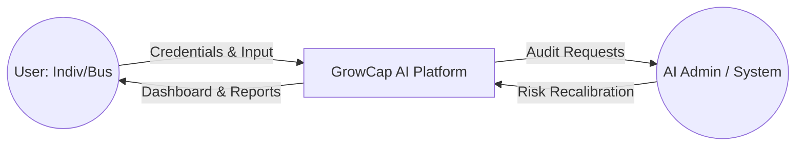
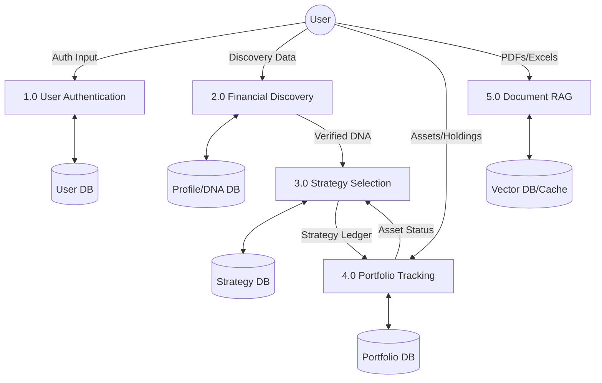
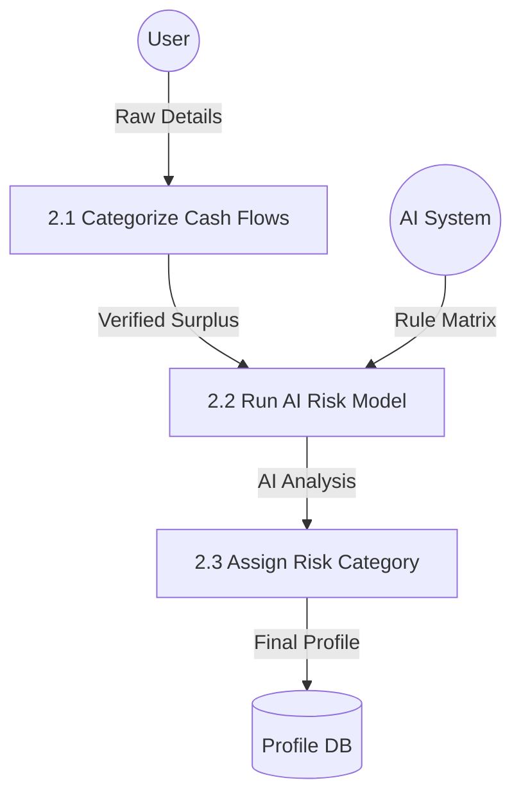

# GrowCap - Data Flow Diagrams (DFD)

This document visualizes the movement of data through the GrowCap platform across three levels of abstraction, following the structure of the system's core functional modules.

---

## 1. Unified DFD Blueprint (Levels 0, 1, 2)

---

## 2. DFD Level 0: Context Diagram

The Context Diagram shows the high-level data exchange between the system and external entities.

---

## 3. DFD Level 1: Functional Diagram

Level 1 decomposes the system into main functional processes and their associated data stores.

---

## 4. DFD Level 2: Detailed Discovery Process

Level 2 examines the "Financial Discovery" process in high detail, showing how income and expenses are transformed into a verified risk score.

---

## 5. Salient Data Flows

- **Surplus Flow**: Monthly Income - Expenses = Investible Surplus (Calculated in P2.1).
- **Strategy Sync**: Strategy Targets are pushed as `strategy_allocation` transactions into the Portfolio Audit ledger (P3 $\rightarrow$ P4).
- **RAG Analysis**: Document text is vectorized and cached for real-time querying (P5).

> [!NOTE]
> All data flows are secured via JWT authentication at the 1.0 (Auth) gate, ensuring that data stores (D1-D5) are only accessible to authorized users.
