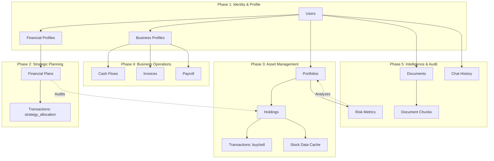

# GrowCap - Detailed ER Diagram & Data Lifecycle

This document provides an exhaustive mapping of every database component within the GrowCap platform, structured by their logical operational flow.

---

## 1. Technical Architectural Blueprint

---

## 2. Logical Component Flow (Mermaid)

This diagram shows the sequence in which data is initialized and linked across the ecosystem.

---

## 3. Data Component Dictionary

### Core Identity Layer
- **`users`**: The root entity. Controls `user_type` (Individual vs Business).
- **`chat_history`**: Persistent store for AI assistant sessions.

### Strategy & DNA Layer
- **`financial_profiles`**: Stores "Financial DNA" (Income, Needs, Wants, Revenue, Payroll).
- **`financial_plans`**: Stores the AI Strategy (Equity%, Safe%, etc.).

### Execution & Asset Layer
- **`portfolios`**: Container for multiple asset buckets.
- **`holdings`**: The actual assets (Stocks, MFs, FDs). Linked to `portfolios`.
- **`transactions`**: High-fidelity ledger for every buy/sell and strategy sync.

### Intelligence & Cache Layer
- **`risk_metrics`**: Cached volatility and audit scores for each portfolio.
- **`stock_data`**: External price data cache for performance tracking.
- **`documents` & `document_chunks`**: RAG (Retrieval Augmented Generation) data store.

### Business Operation Layer (B2B)
- **`business_profiles`**: Deep business metadata (Industry, Employee count).
- **`cash_flows` / `invoices` / `payroll`**: Specialized ledgers for business financial health.

---

## 4. Key Relationships & Constraints

1.  **Strict 1:1 DNA**: Each `user` has exactly one `financial_profile` and one `financial_plan`. This ensures the AI has a singular, consistent strategy to audit against.
2.  **Cascade Policy**: Deleting a `user` cascades and purges all associated financial data, holdings, and documents to ensure GDRP-compliant data handling.
3.  **Audit Integrity**: `transactions` are never deleted; they are appended to ensure a permanent record of all strategic shifts.

> [!IMPORTANT]
> The **'strategy_allocation'** type in the `transactions` table is the bridge between the **Strategy Layer** and the **Asset Layer**, enabling the "Auto-Synced" audit UI.
