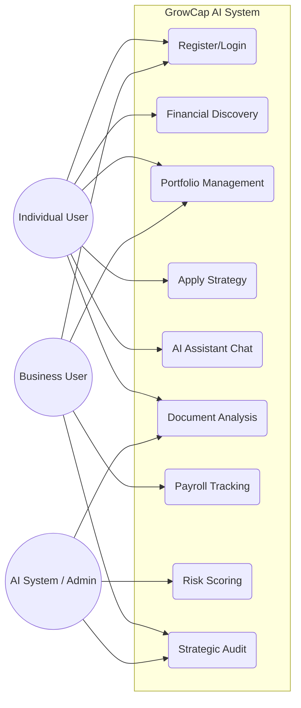

# GrowCap Platform - Master Use Cases & Architecture

This document serves as the definitive guide to the user journeys, system logic, and data architecture of the GrowCap AI platform.

---

## 1. Functional Use Case Diagram (UML)

Following the standard UML structure, this diagram identifies the actors (Individual, Business, AI Admin) and their primary interactions with the system boundary.

---

## 2. End-to-End User Journey Flow

This infographic tracks the flow of data from Discovery through AI Strategy to the final Portfolio Audit.

---

## 3. Data Architecture Integration

The integrity of these use cases is maintained by a robust relational database. Below is the blueprint of how DNA data, strategies, and transactions are linked.

---

## 4. Key Use Case Registry

### UC-1: The "Financial DNA" Discovery (B2C)
- **Goal**: Create a profile for AI evaluation.
- **Workflow**: User inputs income vs. essential overheads. 
- **System Action**: Calculates **Available Surplus** for investment.

### UC-2: The "Business Stability" Audit (B2B)
- **Goal**: Ensure business continuity with payroll and tax reserves.
- **Workflow**: User enters payroll and tax data. 
- **System Action**: Tags profile as "High Risk" if debt-to-revenue ratio exceeds 80%.

### UC-3: Automated Strategic Audit
- **Goal**: Maintain actual holdings vs. AI-driven targets.
- **System Action**: Logs `strategy_allocation` for virtual target tracking.

---

> [!NOTE]
> This master document integrates all visual blueprints and logic flows for the GrowCap system as of April 2026.
